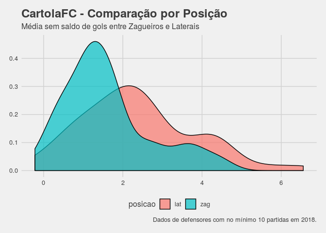

Como escolher defensores?
=========================

Você sabia que aproximadamente 50% de todos os pontos dos zagueiros e laterais vêm do saldo de gols? Nós já apresentamos este método de avaliar as chances de saldo de gols (clean sheets) baseado num clássico modelo estatístico no [post anterior](https://medium.com/@hpgomide/como-montamos-defesas-no-cartolafc-com-estatística-e-modelagem-de-dados-6f5d58ac1034).

Agora é a vez de atacarmos os outros 50%.

``` r
cartola <- read.csv("~/caRtola/src/R/tutoriais/tutorial-2-data.csv", stringsAsFactors = FALSE)
```

Nossos dados cobrem a média dos jogadores até a 25 rodada de 2018. Alguns detalhes:

1.  Escolhemos somente defensores - laterais e zagueiros - que jogaram no mínimo 10 jogos na temporada.
2.  Calculamos as médias dos scouts separados até a rodada em questão
3.  Calculamos a média de pontos dos jogadores retirando o saldo de gols.
4.  Criamos o scout faltas, que é a soma de cartões amarelos e cartões vermelhos.
5.  Criamos o scout shotsX, que é a soma das finalizações para fora, defendidas, na trave e gols.

Como a média dos scouts sem saldo de gols se distribui?
-------------------------------------------------------

``` r
ggplot(data = cartola, aes(x = score.no.cleansheets_mean, fill = posicao)) + 
  geom_density(alpha = .7) + 
  labs(title = "CartolaFC - Comparação por Posição",
       subtitle = "Média sem saldo de gols entre Zagueiros e Laterais",
       caption = "Dados de defensores com no mínimo 10 partidas em 2018.") +
  theme_fivethirtyeight()
```


