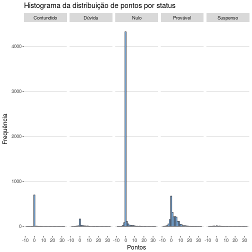

## Motivação

O objetivo deste primeiro estudo responder a pergunta: "Vale a pena usar a média para selecionar um jogador no cartola?"

Este será um tutorial destinado aos *iniciantes* em R e avalia a única medida disponibilizada pelo [Cartola FC](http://globoesporte.globo.com/cartola-fc/index2.html).

## Plano de Análise

Para este tutorial, trabalharemos com os dados do cartola até a nona rodada. Nosso plano de análise consistirá em:

1. Separar nossos dados em dois conjuntos. O primeiro com as estatísticas dos jogadores até a oitava rodada. A partir desse primeiro conjunto, usaremos a média e a compararemos com a mediana para tentarmos prever o desempenho dos jogadores. Para prever o desempenho, criaremos o segundo conjunto com somente os dados da nona rodada.

2. Para entender melhor o problema, iremos usar múltiplas visualizações usando o pacote *ggplot2*, talvez um dos melhores pacotes de R que recentemente foi atualizado. Para deixar tudo mais bonito, usaremos o pacote *ggthemes*.

3. Após, compararemos a média do desempenho com outros modelos um pouco mais complexos.

## Análise dos dados

### Abrir banco
Primeiro, vamos carregar nosso banco de dados.

```r
# Carregar banco de dados
cartola <- read.csv("../../db/2017/cartola_2017.csv", stringsAsFactors = FALSE)
```


### Antes de começar
Antes de começar a realizar as análises precisamos, separar nosso banco em duas partes. Para isso, usamos a função *filter* do pacote *dplyr*. Mas, será que isso esse filtro é suficiente? Vamos dar uma olhada no histograma de distribuição dos pontos.


```r
# Histograma da distribuição de pontos
ggplot(data = cartola, aes(x = atletas.pontos_num)) +
  geom_histogram(bins = 30, fill = ggthemes_data$hc$palettes$default[3], colour = ggthemes_data$hc$palettes$default[2]) + 
  theme_hc() +
  labs(title = "Histograma da distribuição de pontos", x = "Pontos", y = "Frequência")
```


#### Comentário
A distribuição de dados nos mostra que temos muitos valores iguais a zero. Como não aplicamos nenhum filtro, os jogadores que não jogaram sequer uma partida podem bagunçar nossa análise. Vamos ver se com a variável _atletas.rodada_id_ podemos remover a maior quantidade destes zeros.


```r
# Histograma da distribuição de pontos por status
ggplot(data = cartola, aes(x = atletas.pontos_num)) +
  geom_histogram(bins = 30, fill = ggthemes_data$hc$palettes$default[1], colour = ggthemes_data$hc$palettes$default[2]) + 
  facet_grid(~ atletas.status_id) + 
  theme_hc() +
  labs(title = "Histograma da distribuição de pontos por status", x = "Pontos", y = "Frequência") 
```



#### Comentário
Aparentemente temos muitos destes zeros nos status "Contundido", "Nulo". Para simplificar nossa análise, concentremo-nos nos jogadores com status "Provável", ou seja, aqueles que possuem maior probabilidade de entrar em campo. Assim aplicamos segmentamos o banco de dados usando os critérios abaixo.


## Criar banco de dados

```r
treino <- cartola %>%
            filter(atletas.rodada_id < 10 & atletas.status_id == "Provável" & atletas.variacao_num != 0)
validacao <- cartola %>%
            filter(atletas.rodada_id == 10 & atletas.status_id == "Provável" & atletas.variacao_num != 0)
```

#### Comentário
Pronto, agora que fizemos a divisão, precisamos calcular a média de desempenho dos jogadores. Para calcular, usamos novamente o pacote *dplyr* numa cadeia de comandos. Vamos também criar a variável jogos, que é a quantidade de partidas.

### Preparar dados

```r
by_player <- treino %>% 
                group_by(atletas.atleta_id) %>%
                summarise(media = mean(atletas.pontos_num), mediana = median(atletas.pontos_num), 
                          jogos = n_distinct(atletas.rodada_id)- 1)
```

Vamos agora ver como a média dos jogadores se distribui usando novamente um histograma.


```r
ggplot(data = by_player, aes(media)) + 
  geom_histogram(bins = 30, fill = ggthemes_data$hc$palettes$default[3], colour = ggthemes_data$hc$palettes$default[2]) + 
  theme_hc() + 
  labs(title = "Histograma da média de pontos", x = "Pontos", y = "Frequência")
```


#### Comentário
Através do nosso histograma, podemos observar que a distribuição dos pontos é razoavelmente simétrica. No entanto, sabemos que o número de jogos pode influenciar a média de pontos. Talvez, jogadores que jogam menos e têm status de provável pontuam menos que aqueles que entram e possuem melhor pontuação. Lembre-se aqui, que a quantidade de pontos do cartola não necessariamente caracterizam bons jogadores (Cartola != Futebol real). Para verificarmos plotamos as médias em gráficos violino.


```r
ggplot(data = by_player, aes(y = media, factor(jogos))) + 
  geom_violin() + geom_jitter(width = .3, alpha = .5, colour = "#7cb5ec") +
  theme_hc() + 
  labs(title = "Distribuição das médias por número de jogos", x = "Jogos", y = "Média")
```


#### Comentário
Pelas informações do gráfico acima, podemos perceber que a variabilidade da média permanece razoavelmente estável quando o jogador participa de mais de 2 partidas. 

## E a média, vale a pena?
Vamos agora ao que interessa, comparar se a média é um bom indicador (modelo) para prever o desempenho dos jogadores.

Como fazemos isso? O Erro Médio Quadrático (RMSE, do inglês, Root Mean Square Error) e Erro Absoluto da Média (MAE, do inglês, Mean Absolute Error) são métricas usadas para avaliar modelos de predição com desfecho numérico - e.g., pontuação. 

Vamos, então avaliar o quão bem a média é capaz de prever os resultados da nova rodada. Antes disso, precisamos preparar os dados.

```r
# Vamos preparar os dados para fazer a comparação.
# 1. Criamos os dados por jogador da rodada 9
round9_player <- validacao %>% 
                group_by(atletas.atleta_id) %>%
                summarise(pontos = mean(atletas.pontos_num))
# 2. Concatenamos (join) os resultados da nossa predição com os dados da rodada 9 pela id do jogador
dados <- left_join(by_player, round9_player, by = "atletas.atleta_id")
```

Agora podemos ver como a média está ligada aos resultados da rodada 9. Para isso, vamos ao próximo gráfico.


```r
ggplot(data = dados, aes(x = pontos, y = media)) + geom_point(alpha = .8, size = 2) + 
    facet_wrap(~ jogos) +      
    theme_hc() + scale_colour_hc() +
    labs(title = "Dispersão da média e pontuação", x = "Pontos", y = "Média")
```


### RMSE e MAE


```r
dados <- mutate(dados, erro_media = media - pontos, erro_mediana = mediana - pontos)

# Função Root Mean Squared Error
RMSE <- function(error)
{
    sqrt(mean(error^2, na.rm = TRUE))
}
 
# Função Mean Absolute Error
MAE <- function(error)
{
    mean(abs(error), na.rm = TRUE)
}

# Comparar resultados da média e mediana
# RMSE
print(sapply(dados[, c("erro_media","erro_mediana")], RMSE))
```

```
##   erro_media erro_mediana 
##     5.037917     5.026678
```

```r
# MAE
print(sapply(dados[, c("erro_media","erro_mediana")], MAE))
```

```
##   erro_media erro_mediana 
##     3.607697     3.478681
```

## Conclusão
Sim, ao comparar a média com a mediana, podemos notar que em média erramos cinco pontos para mais ou menos a pontuação de um dado jogador. Isto significa que um jogador que pontuação média na oitava rodada igual a 10 pontos, provavelmente pontuará entre 5 e 15 pontos. Assim, fazer predições com base em médias parece ser algo arriscado, embora melhor que simplesmete chutar um atleta.

## Próximo tutorial

Iremos comparar a média contra outros modelos, tentando melhorar nossas previsões. Até o segundo tutorial.

# Dados da sessão


```
## Session info -------------------------------------------------------------
```

```
##  setting  value                       
##  version  R version 3.4.0 (2017-04-21)
##  system   x86_64, linux-gnu           
##  ui       RStudio (1.0.143)           
##  language (EN)                        
##  collate  en_US.UTF-8                 
##  tz       America/Sao_Paulo           
##  date     2017-07-03
```

```
## Packages -----------------------------------------------------------------
```

```
##  package    * version    date       source                         
##  assertthat   0.2.0      2017-04-11 CRAN (R 3.4.0)                 
##  base       * 3.4.0      2017-04-21 local                          
##  bindr        0.1        2016-11-13 CRAN (R 3.4.0)                 
##  bindrcpp   * 0.2        2017-06-17 CRAN (R 3.4.0)                 
##  colorspace   1.3-2      2016-12-14 CRAN (R 3.4.0)                 
##  compiler     3.4.0      2017-04-21 local                          
##  datasets   * 3.4.0      2017-04-21 local                          
##  devtools   * 1.13.2     2017-06-02 CRAN (R 3.4.0)                 
##  digest       0.6.12     2017-01-27 CRAN (R 3.4.0)                 
##  dplyr      * 0.7.1      2017-06-22 CRAN (R 3.4.0)                 
##  evaluate     0.10.1     2017-06-24 CRAN (R 3.4.0)                 
##  ggdendro     0.1-20     2016-04-27 CRAN (R 3.4.0)                 
##  ggplot2    * 2.2.1.9000 2017-06-27 Github (hadley/ggplot2@04a707e)
##  ggthemes   * 3.4.0      2017-02-19 CRAN (R 3.4.0)                 
##  glue         1.1.1      2017-06-21 CRAN (R 3.4.0)                 
##  graphics   * 3.4.0      2017-04-21 local                          
##  grDevices  * 3.4.0      2017-04-21 local                          
##  grid         3.4.0      2017-04-21 local                          
##  gridExtra    2.2.1      2016-02-29 CRAN (R 3.4.0)                 
##  gtable       0.2.0      2016-02-26 CRAN (R 3.4.0)                 
##  highr        0.6        2016-05-09 CRAN (R 3.4.0)                 
##  knitr      * 1.16       2017-05-18 CRAN (R 3.4.0)                 
##  labeling     0.3        2014-08-23 CRAN (R 3.4.0)                 
##  lattice    * 0.20-35    2017-03-25 CRAN (R 3.3.3)                 
##  lazyeval     0.2.0      2016-06-12 CRAN (R 3.4.0)                 
##  magrittr     1.5        2014-11-22 CRAN (R 3.4.0)                 
##  MASS         7.3-47     2017-04-21 CRAN (R 3.4.0)                 
##  Matrix     * 1.2-10     2017-04-28 CRAN (R 3.4.0)                 
##  memoise      1.1.0      2017-04-21 CRAN (R 3.4.0)                 
##  methods    * 3.4.0      2017-04-21 local                          
##  mosaic     * 0.14.4     2016-07-29 CRAN (R 3.4.0)                 
##  mosaicData * 0.14.0     2016-06-17 CRAN (R 3.4.0)                 
##  munsell      0.4.3      2016-02-13 CRAN (R 3.4.0)                 
##  pkgconfig    2.0.1      2017-03-21 CRAN (R 3.4.0)                 
##  plyr         1.8.4      2016-06-08 CRAN (R 3.4.0)                 
##  R6           2.2.2      2017-06-17 CRAN (R 3.4.0)                 
##  Rcpp         0.12.11    2017-05-22 CRAN (R 3.4.0)                 
##  reshape2     1.4.2      2016-10-22 CRAN (R 3.4.0)                 
##  rlang        0.1.1      2017-05-18 CRAN (R 3.4.0)                 
##  scales       0.4.1      2016-11-09 CRAN (R 3.4.0)                 
##  splines      3.4.0      2017-04-21 local                          
##  stats      * 3.4.0      2017-04-21 local                          
##  stringi      1.1.5      2017-04-07 CRAN (R 3.4.0)                 
##  stringr      1.2.0      2017-02-18 CRAN (R 3.4.0)                 
##  tibble       1.3.3      2017-05-28 CRAN (R 3.4.0)                 
##  tidyr        0.6.3      2017-05-15 CRAN (R 3.4.0)                 
##  tools        3.4.0      2017-04-21 local                          
##  utils      * 3.4.0      2017-04-21 local                          
##  withr        1.0.2      2016-06-20 CRAN (R 3.4.0)
```
  
